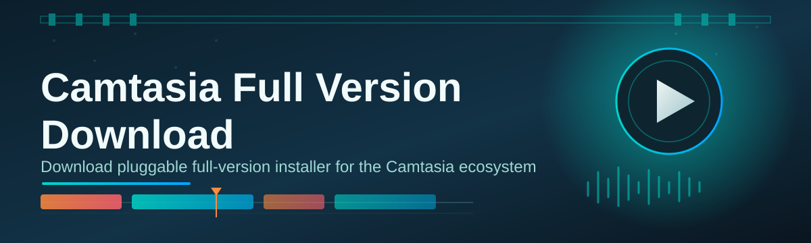
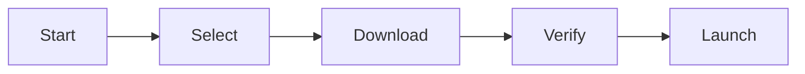

# camtasia-full-version-manager 🎬✨

  

*A tidy, single-purpose manager that gets your Camtasia full version download organized, verified, and ready to launch — no guesswork.*

## 🧭 Overview

I built this because I was tired of the same story every screen-recording season: a dozen browser tabs, three sketchy mirrors, and zero confidence that the installer I just downloaded was actually the right build. `camtasia-full-version-manager` is my answer — a lightweight companion app that centralizes the Camtasia full version download experience into one clean, predictable workflow. It doesn't replace Camtasia itself; it replaces the *chaos* around finding, verifying, and launching the installer.

This project sits at the intersection of "I make tutorials for a living" and "I refuse to babysit a download manager." Whether you're a course creator, a corporate trainer recording onboarding videos, or a streamer who edits highlight reels between matches, the tool is built for people who want their Camtasia setup to just work on Windows 10 or 11 without fifteen minutes of detective work first. It's a passion project, genuinely — I use it myself every time I set up a new editing machine.

Under the hood it's intentionally boring in the best way: no background services, no telemetry you didn't ask for, no dependency soup. Just a focused utility that respects your time and your disk space. If you've ever bookmarked a "Camtasia full version download 2026" page hoping it'd still be valid next month, this project is for you.

> [!NOTE]
> This manager helps you organize and verify your Camtasia full version download process. It is a companion utility, not a substitute for the official Camtasia application itself.

  

---

## 🔥 What Makes It Tick

- **Smart mirror ranking** — instead of trusting a single source, the manager pings known-good endpoints and quietly ranks them by speed and reliability before you even click download.

- **Integrity fingerprinting** — every package gets a checksum pass so you know the file you launched is byte-for-byte what it claims to be, not a repackaged mystery box.

- **Resume-aware transfers** — lost your connection mid-download on a flaky hotel Wi-Fi? The manager picks up exactly where it left off instead of starting from zero.

- **Version shelf** — keep multiple Camtasia build references side by side so you can see what changed between releases without digging through changelogs manually.

- **One-click launch handoff** — once the download completes, the manager hands off straight to the installer with the correct parameters pre-filled. No manual file hunting in your Downloads folder.

- **Zero-bloat footprint** — the entire manager installs in seconds and adds essentially nothing to your startup time. It's a tool, not a tenant.

- **Offline history log** — a simple local log tracks what you downloaded and when, handy for teams that need an audit trail without any cloud account required.

- **Dark and light UI parity** — both themes are fully designed, not an afterthought slapped on top of the light mode.

> [!TIP]
> Pin the manager to your taskbar if you set up new editing rigs often — it turns "reinstall Camtasia" from a 20-minute chore into a two-click routine.

---

## 🚀 How to Get Started

Getting rolling takes about the same time as making coffee:

1. **Visit the landing page** using the download button above — that's the only source this project officially points to.

2. **Grab the installer** for the manager itself; it's a small standalone `.exe`, nothing fancy.

3. **Run it** — Windows might show a SmartScreen prompt for new apps, which is expected for indie tools; choose "More info → Run anyway."

4. **Launch the manager and follow the on-screen flow** to complete your Camtasia full version download and verification in one pass.

> [!IMPORTANT]
> Always download from the official landing page linked in this README. Third-party mirrors outside that page are not maintained by this project and are not covered by any support here.

---

## 🖥️ System Requirements

| Requirement | Details |
|---|---|
| OS | Windows 10 (64-bit) or Windows 11 |
| RAM | 4 GB minimum, 8 GB recommended |
| Disk space | ~500 MB for the manager, plus space for the Camtasia installer itself |
| Dependencies | None — fully standalone, no runtime installs required |
| Internet | Required for the initial download and verification pass |

> [!NOTE]
> No .NET, Java, or Python runtimes needed. The manager is compiled as a self-contained Windows binary on purpose — fewer moving parts, fewer things to break.

---

## ⚙️ How It Works

The whole pipeline is designed to be transparent, not magical:

1. **Launch** the manager and it checks for the current recommended Camtasia build.
2. **Select** your preferred mirror, or let the auto-ranking pick the fastest one for you.
3. **Download** begins with resume support baked in from the first byte.
4. **Verify** runs a checksum pass automatically once the transfer finishes.
5. **Handoff** to the installer completes the Camtasia full version download journey.

<strong>Why the extra verify step matters</strong>

 

A lot of download managers stop at "file arrived." This one stops at "file arrived *and* matches what it's supposed to be." That single extra step is the difference between installing with confidence and installing with your fingers crossed.

---

## 🧩 Troubleshooting

**Q: The manager says my download stalled at 90% — what now?**
A: Just hit resume. The transfer engine remembers your progress and picks up from the last verified chunk instead of restarting.

**Q: Windows Defender flagged the installer, is that normal?**
A: New, less-common binaries sometimes trigger heuristic flags. Check the file hash shown in the manager against the one on the landing page before proceeding.

**Q: Can I run this alongside an existing Camtasia installation?**
A: Yes — the manager only handles the download and verification stage; it never touches your existing Camtasia install or your project files.

**Q: My antivirus quarantined a temp file mid-download.**
A: Add the manager's working folder to your AV exceptions list; temp download chunks sometimes get misread as suspicious archives.

**Q: The mirror ranking seems stuck on one option.**
A: Force a re-scan from the Settings menu — this refreshes latency data instead of relying on cached results.

**Q: Does this work on Windows 8 or older?**
A: No, only Windows 10 and 11 are supported going forward; older platforms aren't part of the 2026 roadmap.

---

## 🎨 UI / UX Details

The interface leans minimal on purpose — big status text, calm colors, no popup spam.

- **Keyboard shortcuts:**
  - `Ctrl + D` — start a new download
  - `Ctrl + V` — force re-verify the last file
  - `Ctrl + L` — open local history log
  - `Esc` — cancel active transfer safely

- **Themes:** Light, Dark, and a high-contrast "Studio" mode built for long editing sessions under dim lighting.

- **Settings that matter:**
  - Bandwidth throttle slider for shared networks
  - Mirror auto-rank toggle (on by default)
  - Notification style: toast, sound, or silent

> [!WARNING]
> Disabling checksum verification in Settings is possible for advanced users, but it removes the one safeguard that confirms your download wasn't tampered with in transit. Leave it on unless you have a specific reason not to.

---

## 🤝 Contributing & Community

This started as a personal itch-scratch project, and it grew because other creators had the exact same frustration with messy Camtasia full version download workflows. Contributions are genuinely welcome:

- Open an issue for bugs, UX friction, or mirror suggestions.
- Submit a pull request for UI polish, translation strings, or performance tweaks.
- Join discussions to propose new features — the roadmap is shaped by actual user pain points, not guesswork.

  

> [!TIP]
> First-time contributors: look for issues tagged `good-first-issue` — most of them are UI copy tweaks or small logic fixes, perfect for getting familiar with the codebase.

---

## 📄 License

Released under the [MIT License](LICENSE), 2026. Use it, fork it, remix it — just keep the license notice intact.

---

## ⚠️ Disclaimer

This project is an independent, community-built manager focused on organizing and verifying the Camtasia full version download and setup process. It is not affiliated with, endorsed by, or sponsored by TechSmith. Camtasia is a trademark of its respective owner. Always ensure your usage complies with the official Camtasia licensing terms.

---

  

